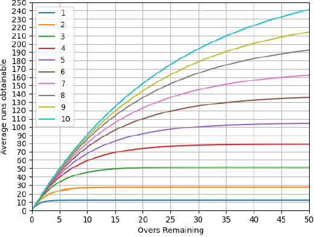
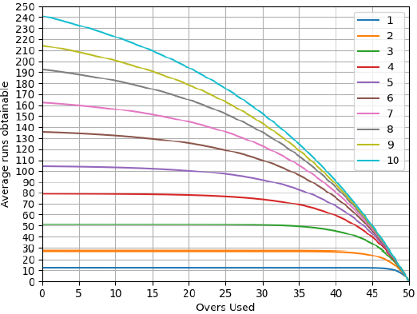

# Duckworth-Lewis-Method
This repo deals with fitting ’runs production function’ using the dataset containing data of ODI games between 1999 and 2011 and obtaining the curves. The DL method is used in cricket to set revised targets in games that are shortened due to rain/bad light.

